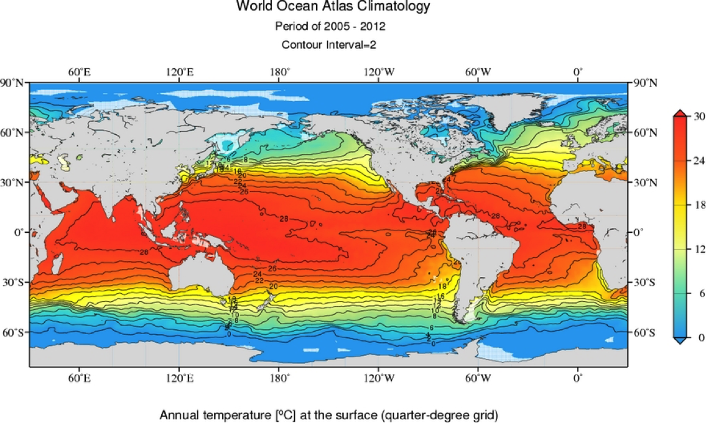
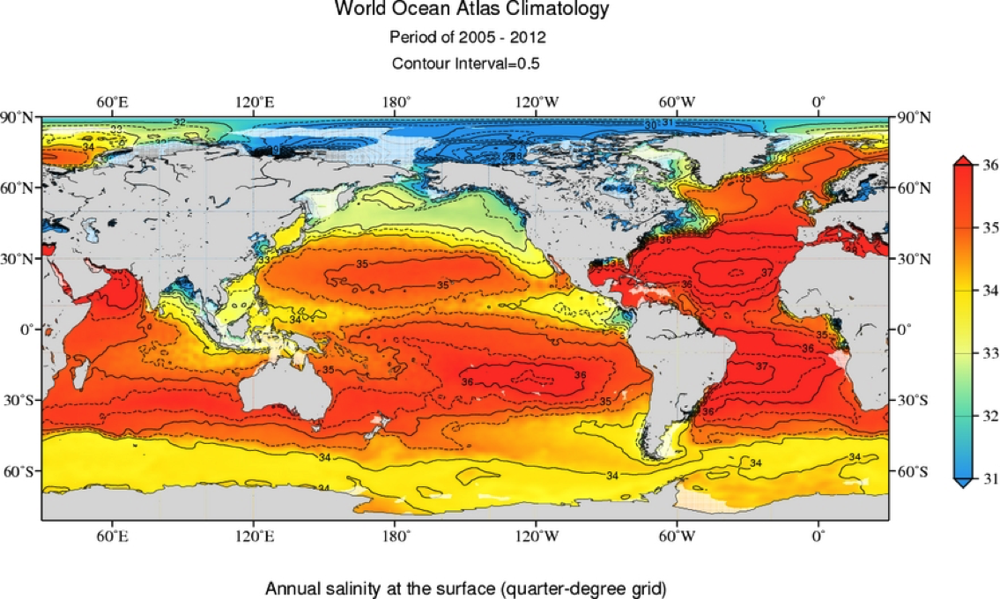

```{r setup, include=FALSE}
knitr::opts_chunk$set(echo = FALSE, warning = FALSE, message = FALSE)
library(tidyverse)
```

Now that we're familiar with some of the basic physical properties of the water, we're going to move on to discuss profiles. These are taken by any device that can move up and down in the water. Traditionally this would be using a shipboard CTD (Conductivity, Temperature, Salinity) device.

## Reading

Watch this video of a CTD in action (made as part of a video blog from a cruise I was on in 2012):

<iframe src="https://player.vimeo.com/video/28984682" width="800" height="450" frameborder="0" allow="autoplay; fullscreen; picture-in-picture" allowfullscreen></iframe>

And review [this information on a CTD](https://www.whoi.edu/what-we-do/explore/instruments/instruments-sensors-samplers/conductivity-temperature-depth-ctd-sensors/)

Review the ocean surface water properties from this section of Segar 
- [Chapter 7](https://www.reefimages.com/oceans/SegarOcean4Chap07.pdf): 
    + Climate and Ocean Surface Water Properties (pg. 154-157). These sections covers the input and removal of heat and water from the ocean.
    
## Assignment

We saw maps of the surface distribution of temperature and salinity in the Segar reading. That reading also discussed why the patterns are the way they are. Below are comparable figures from the World Ocean Circulation Experiment (WOCE) for your reference.





The following image shows five vertical profiles of temperature, salinity and density from around the world. These were all taken from a ship using a CTD at locations shown on the map below. I have labeled all the profiles as letters and shown you all the positions as number, but I haven't matched them up.

```{r profiles}
df <- read_csv("profiles.csv")

varlabs <- c(theta = "Temperature (°C)",
             sal = "Salinity",
             sigma = "Density (kg/m3)")

gather(df, key, value, theta, sal, sigma) %>%
  ggplot(aes(value, z)) +
  geom_path(aes(color = Cruise)) +
  facet_wrap(~factor(key, c("theta", "sal", "sigma")), 
             nrow = 1, scales = "free_x", 
             strip.position="bottom",
             labeller = as_labeller(varlabs)) +
  scale_y_reverse() +
  coord_cartesian(ylim = c(500,0), expand = TRUE) +
  scale_color_discrete(labels = c("A","B","C","D","E")) +
  labs(x = NULL,
       y = "Depth (m)",
       color = "Station") +
  theme_bw() +
  theme(strip.background = element_blank(),
        strip.placement = "outside")
```

```{r profile_map}
xrange <- c(100,360)
xbr <- seq(0,360,30)
xlabs <- ifelse(xbr>180, paste0(360-xbr, "°W"), paste0(xbr,"°E"))

yrange <- c(-90,90)
ybr <- pretty(yrange)
ylabs <- ifelse(ybr>0, paste0(ybr, "°N"), paste0(abs(ybr), "°S"))

group_by(df, Cruise) %>% 
  summarize(lon = mean(lon), lat = mean(lat)) %>%
  ggplot(aes(ifelse(lon<0,lon+360,lon), lat)) +
  geom_polygon(aes(long, lat, group = group), data = map_data("world2"), fill = "grey50") +
  geom_point() +
  geom_label(aes(label = c(2,4,5,1,3)), nudge_x = 10) +
  coord_quickmap(xlim = xrange, ylim = yrange, expand = FALSE) +
  scale_x_continuous(breaks = xbr, labels = xlabs) +
  scale_y_continuous(breaks = ybr, labels = ylabs) +
  labs(x = NULL, y = NULL) +
  theme_bw()

```

* Q1: Use the WOCE surface temperature and salinity maps (above) to match the profiles up to their locations based on the surface temperature and salinity in the profiles.

* Q2: Which profile/regions have the strongest and weakest pycnoclines? Why?

## Next Steps

Submit your answers on the Google Classroom assignment below. Then click the "Level Complete" button to inform your instructors that you've completed the level and need feedback. Wait for feedback before moving on to [Level 3](../level-3).


